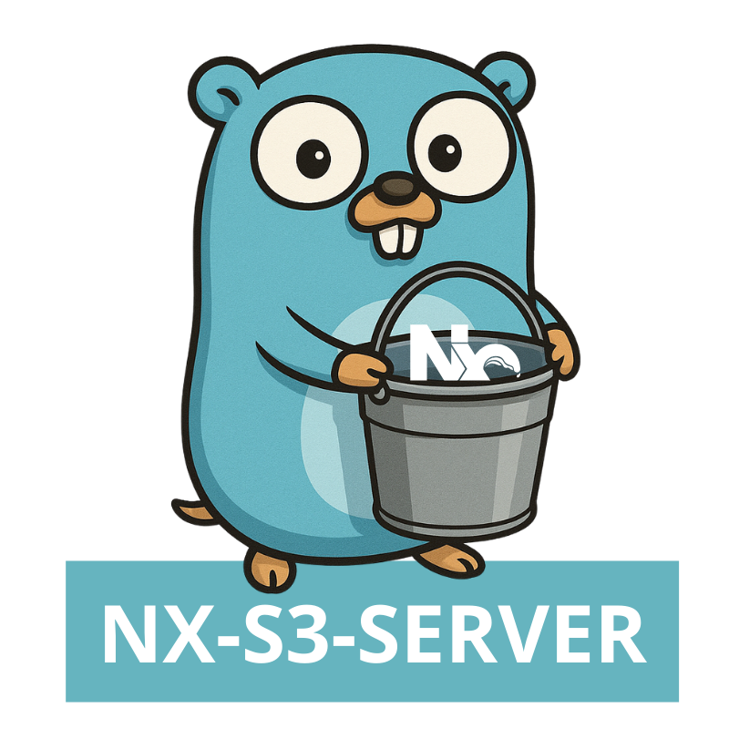

<div align="center">



# NX S3 Server


NXS3Server is a lightweight self-hosted cache server for Nx written in GO.<br/>
It is using AWS S3 Buckets as a backend.

</div>

## Features

- [] Fully satisfies [NX Cache Server Specification](https://nx.dev/recipes/running-tasks/self-hosted-caching#build-your-own-caching-server)
- [x] Token based Authorisation
- [x] Endpoint to get all Cache Artifacts
- [x] Healthcheck

## Installation

```sh
make deps
```

## Local Development

With localstack:

```sh
docker-compose up
```

## Setting up Production

Create secret for:

```
NX_S3_TOKEN
```

Provide AWS Credentials:

```
AWS_ACCESS_KEY_ID
AWS_SECRET_ACCESS_KEY
```

Setup Healthcheck:

```
GET v1/health
```
